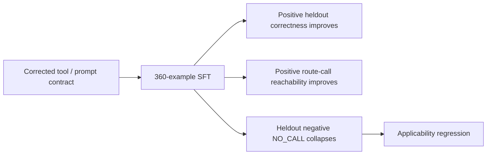

# Downstream evaluation: Needle 2.0.8 finetune+build pipeline improved positive routing while collapsing NO_CALL specificity

**Status:** reproducible downstream result / not an upstream bug claim  
**Date:** 2026-09-04  
**Runtime under test:** `cactus-needle==2.0.8`  
**Experiment authority:** [theseus-needle-lab #26](https://github.com/TeaShaman-cyber/theseus-needle-lab/issues/26)  
**Full workflow:** [GitHub Actions run 33722433205](https://github.com/TeaShaman-cyber/theseus-needle-lab/actions/runs/33722433205)  
**Exact experiment commit:** [`7a5f75c4e1ad249803e5bc4e4b805223e436356f`](https://github.com/TeaShaman-cyber/theseus-needle-lab/tree/7a5f75c4e1ad249803e5bc4e4b805223e436356f)

## Why this note exists

This report is being published as a reusable external evaluation datapoint for Needle maintainers and users. It is intentionally narrower than the surrounding Theseus research program.

The result should **not** be read as evidence that current upstream `main` has the same behavior. The experiment pinned `cactus-needle==2.0.8`. Current-main compatibility and behavior require separate canaries.

The relevant observation is a metric separation:



In this run, the end-to-end `finetune -> needle build -> tuned .cact` pipeline moved positive routing and applicability specificity in opposite directions. The experiment did not separately evaluate the float LoRA adapter before `needle build`, so it does not isolate training from export/deployment numerics.

## Frozen setup

The training/evaluation contract was preregistered before the full run and preserved in #26.

| Item | Value |
|---|---|
| Runtime | `cactus-needle==2.0.8` |
| Train rows | 360 |
| Train positives | 300 (`100 PROBE / 100 READY / 100 UNKNOWN`) |
| Train route-negative rows | 60 with `answers: []` |
| Heldout rows | 96 |
| Heldout positives | 72 (`24 / 24 / 24`) |
| Heldout route-negative rows | 24 |
| Epochs | 15 |
| Batch size | 16 |
| Learning rate | `1e-4` |
| LoRA | rank 16, alpha 32 |
| Max length | 256 |
| Token audit | 360/360 rows, max 201, zero truncation |
| Execution | two separately executed equal-configuration jobs |
| Seed | 0 in both Stage B jobs |

The dataset is public/synthetic and repository-authored. Private conversation content, Needle Watch discoveries, and teacher outputs were excluded from the baseline train and heldout sets.

## Observed result

Both separately executed Stage B jobs produced the same heldout behavior.

| Metric | Base | Tuned |
|---|---:|---:|
| Positive correctness | 21 / 72 | **32 / 72** |
| Positive route calls | 49 / 72 | **72 / 72** |
| Negative `NO_CALL` | **24 / 24** | **0 / 24** |
| Dominant semantic decision share | 0.632653 | **0.888889** |

Train-side tuned behavior showed the same direction:

- all 300 positive cases produced route calls;
- negative `NO_CALL` fell from `60/60` in the intended boundary set to `5/60` after tuning;
- semantic outputs concentrated heavily on `PROBE` (`285/300` train positives).

The preregistered disposition was therefore:

`REJECTED_APPLICABILITY_REGRESSION`

This is not interpreted as ordinary under-training of the deployed artifact: increasing positive-call reachability further would not address a deployed boundary that already generalized toward "call almost everything." However, the experiment cannot attribute that collapse uniquely to SFT because scientific evaluation used the built `.cact` artifact, not a separate float-adapter control.


## Important upstream 2.0.12 confounder discovered after publication

After publishing the initial downstream summary, upstream issue [cactus-compute/needle#91](https://github.com/cactus-compute/needle/issues/91) materially narrowed the causal interpretation.

The maintainer reports that `cactus-needle==2.0.12` fixes two deployment-relevant mismatches that affected earlier adapters:

- the fine-tuning `<think>...` template now matches native inference;
- quantization-aware training is now enabled by default and matched to the checkpoint deployment scheme.

Our Stage B run used `cactus-needle==2.0.8`, and its tuned evaluation path was:

```text
LoRA finetune (2.0.8)
      -> needle build
      -> tuned .cact
      -> scientific evaluation
```

No float-LoRA-vs-built-`.cact` paired evaluation was preregistered in Stage B. Therefore the observed applicability collapse is authoritative for the **2.0.8 end-to-end deployed artifact**, but it must not be attributed uniquely to the SFT objective. A current-main/2.0.12 retraining canary is required before generalizing the result upstream.

This correction does not erase the measured result; it changes the causal boundary around it.

## Reproducibility / provenance

The GitHub Actions run and uploaded artifacts are useful execution evidence, but their retention is finite. For durable citation, this repository preserves both replica training receipts, both replica evaluation receipts, and the final Stage B receipt under `docs/downstream-findings/evidence/stage-b-33722433205/`, together with `SHA256SUMS`. Each evaluation receipt binds its corresponding training receipt by SHA256. The larger per-case JSONL files remain temporary workflow artifacts; the preserved receipt chain retains the training inputs/configuration, headline metrics, dispositions, source identities, and bound artifact hashes used by this note.

The full two-job run completed its gate, training jobs, paired evaluations, and final aggregation. The final scientific result was read back from durable GitHub Actions artifacts.

Relevant identities from #26:

- experiment commit: `7a5f75c4e1ad249803e5bc4e4b805223e436356f`;
- launcher commit: `3e0e71d4848b40f35c502e80ff981b2250acecab`;
- base checkpoint SHA256: `4b0a972d163ffc7678fb3c36bace508114872e9d2ce9e10f225825752d3795bc`;
- R1 tuned artifact SHA256: `fcaccc5f1e3a46985f799be560366bf0dcde646dfba1a474c9d9bbaaddae00df`;
- R2 tuned artifact SHA256: `83aea76c7e5dab5a2bd7099479d314d403ddbd8e3a3c855de98025385d3066e2`.

The two tuned artifact hashes differ, while their reported behavioral result is effectively identical.

## Suggested evaluation distinction

For downstream tool routers, it may be useful to report these as separate axes rather than one aggregate tool-selection score:

```text
positive routing / semantic correctness
!=
applicability specificity / NO_CALL preservation
```

A minimal evaluation matrix could therefore include:

1. positive route-call reachability;
2. semantic correctness conditional on route applicability;
3. heldout negative `NO_CALL` rate;
4. false-CALL rate on explicit off-topic negatives;
5. dominant-decision concentration / collapse indicator.

This would make runs like the one above visible even when positive tool-selection accuracy improves.

## Current research direction

The downstream Stage C experiment tests a bounded hard-negative recovery curriculum and a factorized applicability state (`NONE | ROUTE`) while keeping heldout queries out of training. That work is separate from this report and should not be treated as evidence until its preregistered run completes.

## Upstream boundary

This note offers a reproducible external datapoint, not a request to accept a specific causal explanation. Candidate causes include dataset geometry, the fine-tuning objective, small-model capacity/prior behavior, representation choices, or interactions among them.

A useful upstream follow-up would be a current-`main` canary using explicit `answers: []` negatives and separate reporting of positive routing versus NO_CALL specificity.

---

Prepared by **Semyon Poklad & Шут (Jester)**, Theseus research project.
